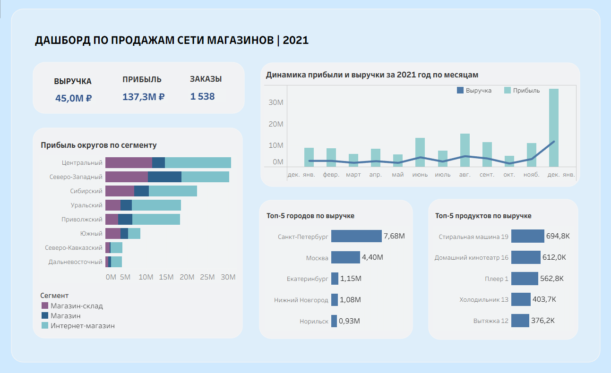

# Аналитика продаж в Tableau
Создание интерактивного BI-дашборда для анализа продаж и ключевых экономических показателей компании.

## Задачи проекта
• Провести анализ исходных данных о продажах  
• Подсчитать основные экономические метрики  
• Разработать и оформить оптимальный дашборд в Tableau  

## Репозиторий содержит:
• файл **[sales.xlsx](./sales.xlsx)** с исходными данными о продажах  
• файл **[Dashboard_sales.twbx](./Dashboard_sales.twbx)** с готовым дашбордом Tableau  
• файл **[dashboard_preview.png](./dashboard_preview.png)** — скриншот дашборда  

## Посмотреть дашборд онлайн:
https://public.tableau.com/app/profile/valeriya.grosheva/viz/Dashboard_sales_17630652791740/Dashboard

## Превью дашборда

